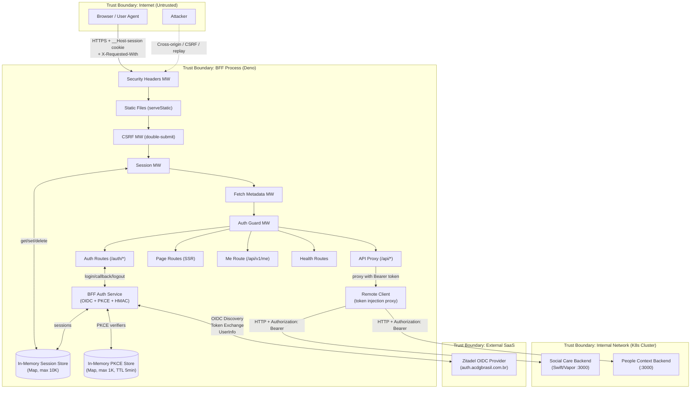

# Threat Model -- Social Care BFF (Deno + Hono)

**Date**: 2026-04-11
**Version**: 1.0
**Analyst**: threat-analyst agent
**Methodology**: STRIDE + DREAD
**System**: social-care-deno BFF (Backend-for-Frontend)

---

## 1. System Overview

The Social Care BFF is a Deno 2.x + Hono server acting as a Backend-for-Frontend (BFF) for the ACDG Brasil social care platform. It serves as the "Iron Frontier" between browsers and internal backend services.

**Core responsibilities:**
- SSR page rendering (hono/jsx) with CSP nonce injection
- OIDC authentication via Zitadel (Authorization Code + PKCE)
- In-memory session management (opaque HMAC-signed cookies)
- API proxy at `/api/*` -- injects Bearer tokens from session store
- Security middleware chain (CSP, HSTS, CSRF, Fetch Metadata, Auth Guard)

**What the browser NEVER sees:**
- Access tokens / refresh tokens / id_tokens
- Client secret
- Backend service URLs (API_BASE_URL, PEOPLE_CONTEXT_BASE_URL)
- Raw CPF/NIS/RG in JavaScript state (SSR-only)

**Deployment:** Single Docker container (denoland/deno:2.7.11), Kubernetes via Flux CD.

---

## 2. Data Flow Diagram

---

## 3. Trust Boundaries

| Boundary | Separates | Risk Level |
|----------|-----------|------------|
| Internet <-> BFF | Untrusted browsers/attackers from BFF process | **CRITICAL** |
| BFF <-> Internal Backends | BFF process from upstream services (K8s internal) | **HIGH** |
| BFF <-> Zitadel | BFF process from external OIDC provider | **HIGH** |
| Browser <-> Token/Secret Plane | Browser JS from all secrets (tokens, URLs, client_secret) | **CRITICAL** |
| Session Cookie <-> Session Store | Opaque cookie ID from actual session data | **HIGH** |

---

## 4. Threat Catalog

| ID | Element | STRIDE | Threat | DREAD Score | Response |
|----|---------|--------|--------|-------------|----------|
| T001 | Session Store | D | In-memory session store lost on restart/OOM | 5.4 | Accept |
| T002 | Session Store | D | Memory exhaustion via session flooding (10K cap) | 5.8 | Mitigate |
| T003 | Session Cookie | S | Session fixation via cookie replay | 3.4 | Mitigate |
| T004 | HMAC Signing | S | Weak SESSION_SECRET enables cookie forgery | 8.0 | Mitigate |
| T005 | id_token Validation | S | id_token decoded without cryptographic signature verification | 7.4 | Mitigate |
| T006 | Token Refresh | S | Refresh token reuse after rotation (replay) | 4.6 | Accept |
| T007 | API Proxy | T | Request body forwarded without domain validation | 5.6 | Mitigate |
| T008 | API Proxy | E | Missing role-based authorization on proxy routes | 7.0 | Mitigate |
| T009 | Auth Callback | S | Open redirect via manipulated state/redirect params | 3.8 | Accept |
| T010 | OIDC Discovery | T | OIDC discovery cache poisoning (DNS/MITM in cluster) | 4.4 | Accept |
| T011 | Remote Client | I | Backend error messages leaked to browser | 4.8 | Mitigate |
| T012 | CSRF MW | S | CSRF cookie not __Host- prefixed in all environments | 4.2 | Mitigate |
| T013 | Health Routes | I | Health/ready endpoints expose internal state | 2.4 | Accept |
| T014 | API Proxy | D | No rate limiting on /api/* routes | 6.4 | Mitigate |
| T015 | Session MW | S | Fallback to raw cookie when tokenRefresher unavailable | 5.0 | Mitigate |
| T016 | Fetch Metadata | S | Sec-Fetch-Site missing allows non-browser bypass | 3.6 | Accept |
| T017 | CSP | I | styleSrc allows unsafe-inline and https: broadly | 4.0 | Mitigate |
| T018 | Pages (SSR) | T | patientId route param passed unsanitized to JSX | 3.4 | Mitigate |
| T019 | Docker | E | Container runs as root (no USER directive) | 5.6 | Mitigate |
| T020 | Logging | R | No structured security event logging (auth, access failures) | 6.2 | Mitigate |
| T021 | Session Store | I | Session data (tokens) held in plaintext in memory | 4.2 | Accept |
| T022 | PKCE Store | D | PKCE store shared in single process -- no horizontal scaling | 4.0 | Accept |
| T023 | Client JS | I | 401 handler redirects to /auth/login -- potential open redirect chain | 3.2 | Accept |
| T024 | Remote Client | T | No TLS verification for intra-cluster HTTP calls | 5.2 | Mitigate |

---

## 5. Threat Details

### T001 -- In-Memory Session Store Volatility
**Category**: Denial of Service
**Element**: Session Store (Map in process memory)
**DREAD**: D:6 R:8 E:3 A:8 D:2 = **5.4**
**Description**: The session store is an in-memory `Map`. Any process restart, deployment, or OOM kill destroys all active sessions, forcing every user to re-authenticate.
**Mitigation**: For the current single-instance deployment, this is an acceptable trade-off. If horizontal scaling is needed, migrate to Redis or encrypted file-based store.
**Priority**: LOW (accepted for current scale)

### T002 -- Session Store Memory Exhaustion
**Category**: Denial of Service
**Element**: Session Store (MAX_SESSIONS = 10,000)
**DREAD**: D:6 R:7 E:5 A:8 D:3 = **5.8**
**Description**: An attacker can repeatedly hit `/auth/callback` to create sessions. The store has a 10K cap with LRU eviction, but legitimate users get evicted when the cap is reached. The PKCE store has a separate 1K cap.
**Mitigation**: Add rate limiting on `/auth/login` and `/auth/callback` endpoints (e.g., 10 req/min per IP). Monitor session store size.
**Priority**: MEDIUM

### T003 -- Session Cookie Replay
**Category**: Spoofing
**Element**: Session Cookie (__Host-session)
**DREAD**: D:5 R:3 E:2 A:2 D:5 = **3.4**
**Description**: HMAC-signed cookies prevent forgery, and __Host- prefix + Secure + HttpOnly + SameSite=Strict is robust. However, if an attacker obtains a valid cookie (XSS, physical access), they can replay it until expiry.
**Mitigation**: Already well-mitigated by cookie attributes. Additional: bind session to client fingerprint (User-Agent hash) or implement session rotation on privilege changes.
**Priority**: LOW

### T004 -- Weak SESSION_SECRET Enables Cookie Forgery
**Category**: Spoofing
**Element**: HMAC cookie signing (SHA-256)
**DREAD**: D:10 R:8 E:7 A:10 D:5 = **8.0**
**Description**: The SESSION_SECRET environment variable is used as the HMAC key for signing session cookies. If the secret is weak, short, or leaked, an attacker can forge arbitrary session IDs and impersonate any user. The `.env.example` shows `SESSION_SECRET=` (empty), meaning deployment relies entirely on operator discipline.
**Mitigation**: (1) Enforce minimum 32-byte entropy for SESSION_SECRET at startup (validate in `loadConfig`). (2) Store in Bitwarden Secret Manager per existing convention. (3) Rotate periodically. (4) Add startup validation that rejects secrets shorter than 32 characters.
**Priority**: CRITICAL

### T005 -- id_token Decoded Without Cryptographic Signature Verification
**Category**: Spoofing
**Element**: `decodeIdTokenPayload` in bff_service.ts
**DREAD**: D:9 R:7 E:6 A:10 D:5 = **7.4**
**Description**: The id_token from Zitadel is decoded using `atob(base64)` and `JSON.parse` -- a pure Base64 decode with no JWS signature verification against JWKS. The code comment says "token came over TLS from provider" but this assumes (a) the token endpoint TLS was not MITM'd in-cluster, (b) no token injection in the callback, and (c) the token was not tampered with in transit. Claims validation (iss, aud, exp) is performed but is trivially bypassable if an attacker controls the JWT payload. The access_token is used as-is to call backends, so the id_token integrity directly determines session identity (userSub, userName, roles).
**Mitigation**: (1) Implement proper JWKS-based signature verification using Zitadel's JWKS endpoint. (2) Fetch and cache JWKS keys (similar to discovery cache pattern already in the code). (3) Validate `alg` header (RS256 expected). (4) Use `crypto.subtle.verify` with the provider's public key. This is the single most impactful security improvement for the system.
**Priority**: CRITICAL

### T006 -- Refresh Token Replay
**Category**: Spoofing
**Element**: Token refresh flow
**DREAD**: D:5 R:5 E:3 A:5 D:5 = **4.6**
**Description**: If Zitadel rotates refresh tokens but the BFF retains the old one (race condition during concurrent refresh attempts), the refresh could fail. Conversely, if Zitadel does NOT rotate, a leaked refresh token can be used indefinitely.
**Mitigation**: The BFF correctly updates the refresh token on successful refresh (`tokenData.refresh_token ?? currentSession.refreshToken`). Zitadel's server-side rotation handles this. Accepted risk.
**Priority**: LOW

### T007 -- Insufficient Request Body Validation on API Proxy
**Category**: Tampering
**Element**: API Proxy routes (/api/v1/*, /api/people/*)
**DREAD**: D:6 R:7 E:5 A:6 D:4 = **5.6**
**Description**: The `validateRequestBody` function contains a TODO comment: "Add path-specific domain validation using smart constructors." Currently it only checks that the body is a JSON object. This means malformed or malicious payloads (e.g., SQL injection in string fields, oversized payloads, unexpected fields) are forwarded directly to the backend.
**Mitigation**: (1) Implement path-specific validation using domain smart constructors (CPF, CNS, NIS, Address, etc.) before proxying. (2) Add request body size limits. (3) Strip unknown fields for known endpoints.
**Priority**: HIGH

### T008 -- No Role-Based Authorization on API Proxy
**Category**: Elevation of Privilege
**Element**: API Proxy routes (/api/v1/*, /api/people/*)
**DREAD**: D:8 R:8 E:6 A:7 D:6 = **7.0**
**Description**: The API proxy checks for a valid session but does NOT check the user's roles before proxying requests. A `social_worker` can access admin-only backend endpoints. The `getAppsForRoles` function only controls UI visibility (defense in depth), not actual API access. The backend (Swift/Vapor) has role guards, but the BFF should enforce as well.
**Mitigation**: (1) Add role-based route mapping in the API proxy (e.g., `/api/v1/admin/*` requires `admin` role). (2) Implement a route-to-role mapping table. (3) Return 403 before proxying if roles are insufficient.
**Priority**: HIGH

### T009 -- Auth Callback Redirect Safety
**Category**: Spoofing
**Element**: Auth routes (/auth/callback, /auth/logout)
**DREAD**: D:4 R:4 E:3 A:5 D:3 = **3.8**
**Description**: After successful callback, the BFF redirects to `/` (hardcoded). After logout, it redirects to OIDC end_session_endpoint with `post_logout_redirect_uri` derived from `config.oidc.redirectUri`. The `deriveBaseUrl` function safely extracts the origin. No user-controlled redirect parameters are used.
**Mitigation**: Already safe. The hardcoded redirects prevent open redirect attacks.
**Priority**: LOW (accepted)

### T010 -- OIDC Discovery Cache Poisoning
**Category**: Tampering
**Element**: OIDC Discovery fetch + 1-hour cache
**DREAD**: D:6 R:3 E:3 A:8 D:2 = **4.4**
**Description**: The BFF fetches `/.well-known/openid-configuration` from the OIDC issuer. If DNS within the cluster is poisoned, an attacker could redirect token exchange to a malicious endpoint. The 1-hour cache TTL limits the window but also delays recovery.
**Mitigation**: The fetch occurs over HTTPS (issuer URL starts with https://). K8s NetworkPolicy should restrict egress. Accepted risk given HTTPS validation.
**Priority**: LOW (accepted)

### T011 -- Backend Error Message Leakage
**Category**: Information Disclosure
**Element**: Remote Client response handling
**DREAD**: D:4 R:8 E:4 A:5 D:3 = **4.8**
**Description**: The API proxy forwards the full JSON response body from backends to the browser (line: `c.json(responseBody, responseStatus)`). If the backend returns stack traces, internal IP addresses, or SQL errors in error responses, these leak to the client.
**Mitigation**: (1) Sanitize error responses from backends -- only forward known-safe fields. (2) Map backend 4xx/5xx to generic BFF error responses. (3) Log full backend errors server-side.
**Priority**: MEDIUM

### T012 -- CSRF Cookie Not Using __Host- Prefix Consistently
**Category**: Spoofing
**Element**: CSRF Middleware
**DREAD**: D:5 R:5 E:3 A:5 D:3 = **4.2**
**Description**: The CSRF cookie is named `__Host-csrf` and set with `secure: true, sameSite: Strict`. However, unlike the session cookie, there is no dev-mode fallback. If the app is accessed over HTTP in development, CSRF tokens will not be set (browsers reject __Host- cookies over HTTP). More importantly, the cookie is set with `httpOnly: false` by design (client JS must read it), which means XSS can exfiltrate the CSRF token.
**Mitigation**: (1) The httpOnly:false is required for double-submit pattern -- this is expected. (2) CSP with nonce mitigates XSS. (3) Consider adding a development-mode CSRF cookie name without __Host- prefix, matching the session cookie pattern.
**Priority**: LOW

### T013 -- Health Endpoints Information Disclosure
**Category**: Information Disclosure
**Element**: /health, /ready routes
**DREAD**: D:2 R:5 E:1 A:2 D:2 = **2.4**
**Description**: Health endpoints return `{ status: "ok" }` and `/ready` adds a timestamp. Minimal information exposure.
**Mitigation**: Already minimal. In production, consider restricting to K8s internal probes only (via Fetch Metadata or IP allowlist).
**Priority**: LOW (accepted)

### T014 -- No Rate Limiting on API Routes
**Category**: Denial of Service
**Element**: API proxy, Auth routes
**DREAD**: D:7 R:8 E:6 A:7 D:4 = **6.4**
**Description**: There is no rate limiting on any route. An attacker can flood `/api/*` (amplified to backends), `/auth/login` (PKCE store pressure + OIDC provider abuse), or SSR pages (CPU for JSX rendering).
**Mitigation**: (1) Add per-IP rate limiting middleware (e.g., sliding window, 100 req/min for API, 10 req/min for auth). (2) Consider Hono's built-in or third-party rate limiter. (3) Add connection limits at the infrastructure level (K8s Ingress annotations).
**Priority**: HIGH

### T015 -- Session Middleware Raw Cookie Fallback
**Category**: Spoofing
**Element**: Session middleware (session.ts, line 38-39)
**DREAD**: D:7 R:4 E:4 A:5 D:5 = **5.0**
**Description**: When `tokenRefresher` is not set in the Hono context, the session middleware falls back to using the raw cookie value as the session ID without HMAC verification. The comment says "for tests without HMAC" but this path could be triggered in production if the middleware ordering is incorrect or if there is a race condition during startup.
**Mitigation**: (1) Remove the raw cookie fallback or restrict it to a `NODE_ENV=test` check. (2) Ensure `tokenRefresher` is always set before session middleware runs (already done in server.ts line 40). (3) Add a defensive check that rejects requests if `tokenRefresher` is undefined in production.
**Priority**: MEDIUM

### T016 -- Sec-Fetch-Site Missing Header Bypass
**Category**: Spoofing
**Element**: Fetch Metadata middleware
**DREAD**: D:4 R:4 E:3 A:4 D:3 = **3.6**
**Description**: The Fetch Metadata middleware allows requests where `Sec-Fetch-Site` is missing (non-browser clients). This is intentional for curl/API testing but means automated tools (without browser headers) bypass this check. The `X-Requested-With: XMLHttpRequest` requirement provides defense-in-depth.
**Mitigation**: Already mitigated by the mandatory X-Requested-With header. The combination of both checks is robust. Accepted risk.
**Priority**: LOW (accepted)

### T017 -- CSP styleSrc Overly Permissive
**Category**: Information Disclosure
**Element**: Security Headers (CSP)
**DREAD**: D:4 R:5 E:3 A:5 D:3 = **4.0**
**Description**: `styleSrcElem` includes `'unsafe-inline'`, `'self'`, and `https:`. While `'unsafe-inline'` is a fallback for non-CSP3 browsers (nonce takes precedence), the `https:` wildcard allows loading stylesheets from any HTTPS origin, which could be used for CSS-based data exfiltration.
**Mitigation**: (1) Replace `https:` in `styleSrcElem` with specific domains (Google Fonts, Fontshare). (2) Keep `'unsafe-inline'` as CSP3 fallback.
**Priority**: MEDIUM

### T018 -- Route Parameter Injection in SSR
**Category**: Tampering
**Element**: Pages route `/family-composition/:patientId`
**DREAD**: D:3 R:5 E:3 A:3 D:3 = **3.4**
**Description**: The `patientId` URL parameter is passed directly to the `<FamilyView patientId={patientId} />` JSX component. Hono's JSX auto-escapes HTML entities, preventing XSS in rendered output. However, if this value is used in client-side JavaScript (data attributes, embedded JSON), escaping may not be sufficient.
**Mitigation**: (1) Validate `patientId` format (UUID) before passing to view. (2) Hono JSX escaping provides baseline protection.
**Priority**: LOW

### T019 -- Docker Container Runs as Root
**Category**: Elevation of Privilege
**Element**: Dockerfile
**DREAD**: D:7 R:7 E:4 A:5 D:5 = **5.6**
**Description**: The Dockerfile does not include a `USER` directive. The Deno process runs as root inside the container. If the process is compromised (e.g., via a Deno vulnerability or dependency), the attacker has root access within the container.
**Mitigation**: Add `USER deno` (the denoland/deno image includes a `deno` user) before the `CMD` instruction. Also add `RUN chown -R deno:deno /app`.
**Priority**: MEDIUM

### T020 -- No Security Event Logging
**Category**: Repudiation
**Element**: All middleware and routes
**DREAD**: D:6 R:7 E:5 A:8 D:5 = **6.2**
**Description**: There is no structured logging for security-relevant events: failed logins, CSRF rejections, Fetch Metadata blocks, session expirations, token refresh failures, 401/403 responses. This makes incident detection, forensics, and compliance auditing impossible.
**Mitigation**: (1) Add structured JSON logging for all security events. (2) Include: timestamp, event type, IP, user agent, session ID (hashed), path, outcome. (3) Integrate with centralized logging (e.g., Loki, CloudWatch).
**Priority**: HIGH

### T021 -- Session Tokens in Plaintext Memory
**Category**: Information Disclosure
**Element**: Session Store
**DREAD**: D:5 R:3 E:3 A:5 D:5 = **4.2**
**Description**: Access tokens, refresh tokens, and id_tokens are stored in plaintext in the in-memory Map. A memory dump (core dump, heap snapshot, or Deno inspector) would expose all active tokens.
**Mitigation**: For in-memory stores this is inherent. Mitigated by: (1) Deno permission model (--allow-net, --allow-env, --allow-read only). (2) No --allow-run permission. (3) Container isolation. Accepted risk.
**Priority**: LOW (accepted)

### T022 -- PKCE Store Not Suitable for Horizontal Scaling
**Category**: Denial of Service
**Element**: PKCE Store (in-memory Map)
**DREAD**: D:4 R:5 E:2 A:5 D:4 = **4.0**
**Description**: The PKCE verifier store is in-process memory. If the BFF is scaled to multiple replicas, a login initiated on replica A will fail at callback on replica B. Same applies to the session store.
**Mitigation**: For single-replica deployment, this is acceptable. Document the constraint. When scaling, migrate both stores to Redis.
**Priority**: LOW (accepted for single-replica)

### T023 -- Client-Side 401 Redirect
**Category**: Information Disclosure
**Element**: base-client.ts (client-side)
**DREAD**: D:3 R:3 E:3 A:3 D:4 = **3.2**
**Description**: On 401 response, the client redirects to `/auth/login` via `globalThis.location.href`. This is a same-origin redirect to a known path, not an open redirect.
**Mitigation**: Already safe.
**Priority**: LOW (accepted)

### T024 -- No TLS for Intra-Cluster Backend Calls
**Category**: Tampering
**Element**: Remote Client HTTP calls to backends
**DREAD**: D:6 R:5 E:4 A:8 D:3 = **5.2**
**Description**: The BFF communicates with backend services over plain HTTP within the K8s cluster (`http://social-care:3000`). Bearer tokens are sent in the Authorization header over unencrypted connections. An attacker with network access within the cluster (compromised pod, network tap) could intercept tokens.
**Mitigation**: (1) Enable mTLS via service mesh (Istio/Linkerd). (2) Use K8s NetworkPolicy to restrict pod-to-pod traffic. (3) If service mesh is not feasible, configure backends to accept connections only from the BFF pod IP range.
**Priority**: MEDIUM

---

## 6. OWASP Top 10 (2021) Compliance

| Category | Status | Notes |
|----------|--------|-------|
| **A01: Broken Access Control** | Partial | Auth guard enforces session presence. However, no role-based authorization on API proxy (T008). App registry filtering is UI-only. Backend has RBAC but BFF should enforce as defense-in-depth. CORS not explicitly configured (defaults to same-origin). No IDOR prevention at BFF level. |
| **A02: Cryptographic Failures** | Partial | HSTS enforced (63072000s, includeSubDomains). HMAC-SHA256 for cookie signing. PKCE with S256. However: id_token not cryptographically verified (T005). Intra-cluster traffic is plain HTTP (T024). SESSION_SECRET has no entropy validation (T004). |
| **A03: Injection** | Conforme | Hono JSX auto-escapes output. No SQL at BFF layer. JSON body parsing with explicit error handling. No eval() or Function(). Domain branded types provide validation layer. TODO: implement domain validation on proxy bodies (T007). |
| **A04: Insecure Design** | Conforme | BFF pattern isolates secrets from browser. Defense-in-depth with multiple middleware layers. Result pattern prevents unhandled errors. Trust boundaries documented. This threat model addresses the requirement. |
| **A05: Security Misconfiguration** | Conforme | CSP with nonce (strict-dynamic), HSTS, X-Frame-Options: DENY, X-Content-Type-Options: nosniff, Permissions-Policy (camera/mic/geo denied), Referrer-Policy. Error responses do not expose stack traces at BFF level. Minor: CSP styleSrcElem too broad (T017). Docker runs as root (T019). |
| **A06: Vulnerable Components** | Conforme | Zero node_modules. Dependencies from Deno registry (jsr:). Only 2 external deps: @hono/hono v4, @std/assert. Deno's permission model limits blast radius. No deno.lock observed -- recommend adding. |
| **A07: Authentication Failures** | Partial | OIDC via Zitadel with PKCE (S256). Session cookies have proper attributes (__Host-, HttpOnly, Secure, SameSite=Strict). Token auto-refresh with 5min buffer. However: no rate limiting on auth endpoints (T014). id_token not signature-verified (T005). MFA is delegated to Zitadel (not BFF concern). |
| **A08: Software and Data Integrity** | Partial | Dockerfile uses pinned Deno version (2.7.11). No deno.lock file for dependency pinning. Client bundles built at Docker build time (reproducible). No subresource integrity (SRI) on inline scripts (nonce used instead). |
| **A09: Security Logging & Monitoring** | Non-Conforme | No security event logging (T020). No failed auth logging. No access failure logging. No alerting. No audit trail. `console.log` used only for startup message. This is the largest compliance gap. |
| **A10: SSRF** | Conforme | Backend URLs are configured via environment variables, not user input. The API proxy maps fixed path prefixes (/api/v1/*, /api/people/*) to fixed base URLs. No user-controlled URL construction. `deriveBaseUrl` uses `new URL()` safely. |

---

## 7. Risk Matrix

|  | Low Impact (1-3) | Medium Impact (4-6) | High Impact (7-10) |
|---|---|---|---|
| **High Likelihood** (7-10) | T016 (Sec-Fetch bypass) | T007 (body validation), T014 (rate limiting), T020 (logging) | **T005 (id_token no sig verify)**, **T004 (weak secret)**, **T008 (no RBAC on proxy)** |
| **Medium Likelihood** (4-6) | T013 (health info), T018 (route param), T023 (401 redirect) | T002 (session flood), T011 (error leak), T015 (cookie fallback), T017 (CSP style), T019 (Docker root), T024 (no mTLS) | T012 (CSRF cookie) |
| **Low Likelihood** (1-3) | T003 (cookie replay) | T001 (session volatility), T006 (refresh replay), T010 (discovery poison), T021 (memory tokens), T022 (scaling) | -- |

---

## 8. Recommended Mitigations (Prioritized)

### [CRITICAL] -- Must fix before production

1. **T005: Implement JWKS-based id_token signature verification.**
   - Fetch JWKS from `{issuer}/.well-known/openid-configuration` -> `jwks_uri`.
   - Cache JWKS keys (same pattern as discovery cache).
   - Verify id_token signature using `crypto.subtle.verify("RSASSA-PKCS1-v1_5", ...)`.
   - Validate `alg` claim matches expected algorithm (RS256).
   - File: `src/adapters/auth/bff_service.ts`, function `decodeIdTokenPayload`.
   - Effort: 1-2 days.

2. **T004: Enforce SESSION_SECRET minimum entropy at startup.**
   - Add validation in `loadConfig()`: `if (sessionSecret.length < 32) throw`.
   - Document requirement in `.env.example`.
   - Consider generating a secure default for development.
   - File: `src/adapters/config/server_config.ts`.
   - Effort: 1 hour.

### [HIGH] -- Fix before next release

3. **T008: Add role-based authorization to API proxy.**
   - Create a route-to-roles mapping table.
   - Check `session.roles` against required roles before proxying.
   - Return 403 for insufficient privileges.
   - File: `src/routes/api.ts`.
   - Effort: 1 day.

4. **T014: Add rate limiting middleware.**
   - Implement sliding-window rate limiter per IP.
   - Configure: 100 req/min for `/api/*`, 10 req/min for `/auth/*`.
   - Use in-memory Map with sweep (similar to PKCE store pattern).
   - File: new `src/middleware/rate_limiter.ts`.
   - Effort: 1 day.

5. **T020: Implement structured security logging.**
   - Create a security event logger with JSON output.
   - Log: auth events, CSRF/Fetch-Metadata blocks, 401/403 responses, session lifecycle, token refresh outcomes.
   - Include: timestamp, event type, IP, user agent, path, sessionId (truncated hash).
   - File: new `src/adapters/logging/security_logger.ts`.
   - Effort: 1-2 days.

6. **T007: Implement domain validation on proxy request bodies.**
   - Wire domain smart constructors (CPF, CNS, Address, etc.) into `validateRequestBody`.
   - Add request body size limit (e.g., 1MB).
   - File: `src/routes/api.ts`.
   - Effort: 2-3 days.

### [MEDIUM] -- Plan for upcoming sprint

7. **T019: Run Docker container as non-root.**
   - Add `USER deno` to Dockerfile.
   - Add `RUN chown -R deno:deno /app` before USER directive.
   - File: `Dockerfile`.
   - Effort: 30 minutes.

8. **T017: Tighten CSP styleSrcElem.**
   - Replace `https:` with specific font/style domains.
   - File: `src/middleware/security_headers.ts`.
   - Effort: 30 minutes.

9. **T015: Remove raw cookie fallback in production.**
   - Gate the fallback on an explicit `config.secureCookies === false` check.
   - File: `src/middleware/session.ts`.
   - Effort: 30 minutes.

10. **T024: Enable mTLS for intra-cluster traffic.**
    - Deploy service mesh (Istio/Linkerd) or configure K8s NetworkPolicy.
    - Effort: Depends on infrastructure team.

11. **T011: Sanitize backend error responses.**
    - Map backend error responses to generic BFF error format.
    - Log full backend errors server-side.
    - File: `src/routes/api.ts`.
    - Effort: 1 day.

### [LOW] -- Backlog

12. Add `deno.lock` for dependency pinning (A08 compliance).
13. Add Subresource Integrity (SRI) for externally loaded resources.
14. Validate `patientId` format (UUID) in page routes (T018).
15. Document single-replica constraint for session/PKCE stores (T022).

---

## 9. Accepted Risks

| ID | Threat | Justification |
|----|--------|---------------|
| T001 | Session store volatility | Single-replica deployment. Users re-authenticate on restart. Acceptable for current scale. |
| T006 | Refresh token replay | Mitigated by Zitadel server-side rotation. BFF correctly updates stored tokens. |
| T009 | Auth redirect safety | All redirects are hardcoded to known paths. No user-controlled redirect parameters. |
| T010 | OIDC discovery cache poisoning | HTTPS protects the fetch. K8s NetworkPolicy should restrict egress. |
| T013 | Health endpoint info | Minimal information returned. Restrict via infra if needed. |
| T016 | Missing Sec-Fetch-Site bypass | Mitigated by mandatory X-Requested-With header on all /api/* requests. |
| T021 | Tokens in plaintext memory | Inherent to in-memory stores. Mitigated by Deno permission model and container isolation. |
| T022 | PKCE/session store scaling | Single-replica. Document constraint. Migrate to Redis when scaling. |
| T023 | Client 401 redirect | Same-origin redirect to known `/auth/login` path. Not an open redirect. |

---

## 10. ASVS Level Assessment

Given that this is a **healthcare social care application** handling sensitive PII (CPF, NIS, RG, health records, family composition), the target ASVS level should be **Level 2** (Standard) with aspirations toward **Level 3** (Advanced) for data handling.

| ASVS Section | Current Level | Target | Gap |
|---|---|---|---|
| V2: Authentication | L1 | L2 | Missing: id_token signature verification, rate limiting on auth |
| V3: Session Management | L2 | L2 | Session cookies well-configured. Missing: session binding to client characteristics |
| V4: Access Control | L1 | L2 | Missing: role-based enforcement at BFF proxy layer |
| V5: Validation | L1 | L2 | Missing: domain validation on proxy request bodies |
| V7: Error Handling & Logging | L0 | L2 | Major gap: no security event logging at all |
| V8: Data Protection | L1 | L2 | PII restricted to SSR (good). Tokens in plaintext memory (accepted). No mTLS. |
| V9: Communications | L1 | L2 | HTTPS enforced for browser. Missing mTLS for intra-cluster. |
| V13: API | L1 | L2 | Missing: rate limiting, response sanitization |
| V14: Configuration | L1 | L2 | Missing: SESSION_SECRET validation, Docker non-root, deno.lock |

---

## 11. Executive Summary

The Social Care BFF demonstrates **strong security fundamentals**: the BFF architecture correctly isolates tokens from browsers, cookie security attributes are properly configured (__Host- prefix, HttpOnly, Secure, SameSite=Strict), PKCE is implemented with S256, CSP uses per-request nonces with strict-dynamic, and the Fetch Metadata + X-Requested-With combination provides robust CSRF/cross-origin protection.

**Two critical gaps must be addressed before production:**
1. The id_token is decoded but not cryptographically verified (T005) -- this is the highest-impact finding.
2. The SESSION_SECRET has no minimum entropy validation (T004).

**Three high-priority gaps should be addressed in the next release:**
3. No role-based authorization at the BFF proxy layer (T008).
4. No rate limiting on any endpoint (T014).
5. Zero security event logging (T020).

The system's architectural decisions (Result pattern, branded types, immutability, no-throw in domain/application) provide defense-in-depth at the code level. The middleware chain ordering is correct. The main risks are operational (logging, rate limiting) and one protocol-level gap (JWT verification).
