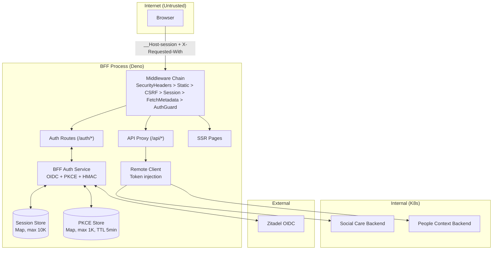

# Full Security Assessment -- Social Care BFF (Deno + Hono)

**Date**: 2026-04-11
**Lead**: security-orchestrator
**Agents Used**: 6/6
**Project**: social-care-deno (Deno 2.x + Hono BFF)

---

## Executive Summary

The Social Care BFF demonstrates **strong security foundations**: the BFF architecture correctly isolates tokens from browsers, cookie security is properly configured (`__Host-` prefix, HttpOnly, Secure, SameSite=Strict), PKCE uses S256 with proper crypto, CSP employs per-request nonces with `strict-dynamic`, Sec-Fetch-Site + X-Requested-With provides robust cross-origin protection, and the functional/immutable codebase (no `throw`, no `class`, no `this` in domain) prevents entire vulnerability classes. The dependency surface is minimal (3 packages, zero npm).

However, **5 critical findings must be addressed before production**:
1. The id_token is decoded without cryptographic signature verification
2. The id_token claims validation silently skips missing mandatory claims
3. Live OIDC client secret and SESSION_SECRET exist on disk (`.env`)
4. SESSION_SECRET has no minimum entropy validation
5. No CI/CD pipeline exists for the BFF

The system's risk profile is primarily **operational/configuration gaps** rather than fundamental design flaws. The architecture is sound -- the gaps are in verification, enforcement, and tooling.

**Top recommendation**: Implement JWKS-based id_token signature verification. This single fix addresses the highest-impact vulnerability and brings the auth flow into OIDC spec compliance.

---

## Security Score: 52/100

### Score Breakdown

| Dimension | Score | Agent | Notes |
|-----------|-------|-------|-------|
| Architecture & Design | 10/15 | threat-analyst | Strong BFF pattern, trust boundaries, CSP. Gaps: 2 critical protocol issues |
| Code Vulnerabilities | 12/25 | pentest-scanner | 2 CRITICAL + 4 HIGH, but no injection/XSS/SSRF in code. Strong fundamentals |
| Authentication & Access | 11/20 | auth-auditor | PKCE S256 correct, cookie security excellent. CRITICAL: no sig verify, no RBAC |
| API Security | 8/15 | api-hardener | Good headers/CSRF/fetch-metadata. Missing: rate limiting, body limits, cache-control |
| Infrastructure & DevSecOps | 5/15 | pipeline-security-auditor | No CI/CD pipeline, Docker as root, no .dockerignore, no image scanning |
| Code Quality & Practices | 6/10 | secure-code-reviewer | Clean domain layer, Result pattern. Gaps in edge-case handling |

---

## Critical Findings (MUST FIX)

### C1. id_token Decoded Without Cryptographic Signature Verification
- **Agents**: threat-analyst (T005), pentest-scanner (PENTEST-01), auth-auditor (CRITICAL-01)
- **File**: `src/adapters/auth/bff_service.ts:165-178`
- **CVSS**: 9.1 | **DREAD**: 7.4
- **Description**: `decodeIdTokenPayload` does a raw base64 decode without JWKS-based JWS signature verification. The comment says "token came over TLS from provider" but this violates OIDC Core spec Section 3.1.3.7. Combined with C2, an attacker who can intercept the token endpoint response can forge any identity with any role.
- **Fix**: Use `jose` library with `jwtVerify()` against Zitadel's JWKS endpoint. Validate `alg` header (RS256).
- **Effort**: 1-2 days

### C2. validateIdTokenClaims Silently Accepts Missing Mandatory Claims
- **Agents**: secure-code-reviewer (CRITICAL), pentest-scanner (part of PENTEST-01), auth-auditor (MED-05)
- **File**: `src/adapters/auth/bff_service.ts:184-211`
- **Description**: Validation uses `if (payload.iss !== undefined && ...)` pattern -- missing `iss`, `aud`, or `exp` claims are silently accepted. A forged token `{"sub":"admin"}` with no standard claims passes all validation. This is the last line of defense when C1 exists.
- **Fix**: Change to require all mandatory OIDC claims: `if (!payload.iss || !payload.sub || !payload.aud || !payload.exp) return err(...)`.
- **Effort**: 30 minutes

### C3. Live Secrets on Disk in `.env` File
- **Agents**: pentest-scanner (PENTEST-02), pipeline-security-auditor (CRIT-01)
- **File**: `.env` (untracked but present on disk)
- **Description**: Contains real OIDC client secret, SESSION_SECRET, client_id, and HML backend URLs. While `.gitignore` excludes `.env`, the secrets appeared in this audit and must be rotated.
- **Fix**: Immediately rotate OIDC client secret in Zitadel and SESSION_SECRET. Use Bitwarden Secrets Manager per project conventions.
- **Effort**: 1 hour

### C4. No SESSION_SECRET Entropy Validation
- **Agents**: threat-analyst (T004), pentest-scanner (PENTEST-06), auth-auditor (HIGH-02), pipeline-security-auditor (CRIT-02)
- **File**: `src/adapters/config/server_config.ts:45`
- **DREAD**: 8.0
- **Description**: `requireEnv("SESSION_SECRET")` only checks non-empty. A secret like `"abc"` gives 24 bits for HMAC-SHA256 -- trivially brute-forceable, enabling session cookie forgery.
- **Fix**: Require minimum 32 characters (256 bits) at startup. Reject low-entropy patterns.
- **Effort**: 30 minutes

### C5. No CI/CD Pipeline for the BFF Application
- **Agent**: pipeline-security-auditor (CRIT-03)
- **Description**: No `.github/workflows/` directory exists for the BFF. Zero automated tests, security scans, or build checks on push/PR. The local `.githooks/pre-push` is the only safety net and can be bypassed with `--no-verify`.
- **Fix**: Create GitHub Actions workflow with lint, test, security scan, container build+scan.
- **Effort**: 1 day

---

## High Findings

### H1. No Role-Based Authorization on API Proxy
- **Agents**: threat-analyst (T008), pentest-scanner (PENTEST-03), auth-auditor (CRITICAL-02), api-hardener (F03)
- **File**: `src/routes/api.ts:119-161`
- **CVSS**: 8.2 | **DREAD**: 7.0
- **Description**: Proxy checks `if (!session)` but never inspects `session.roles`. Any authenticated user (educator, health_professional) can access all patient endpoints, social data, and people-context APIs. Roles exist in the session but are never enforced.
- **Fix**: Add role-checking middleware with route-to-roles mapping table. Return 403 before proxying.
- **Effort**: 1 day

### H2. Zero Rate Limiting on Any Endpoint
- **Agents**: threat-analyst (T014), pentest-scanner (PENTEST-04), auth-auditor (HIGH-01), api-hardener (F01)
- **CVSS**: 7.5 | **DREAD**: 6.4
- **Description**: No throttling anywhere. Enables PKCE store exhaustion (DoS), brute-force on callback, bulk data exfiltration, and session store flooding.
- **Fix**: Create `src/middleware/rate_limit.ts` -- sliding window per IP. 10 req/min for `/auth/*`, 60 req/min for `/api/*`, 200 req/15min global.
- **Effort**: 1 day

### H3. Timing-Unsafe HMAC Signature Comparison
- **Agents**: pentest-scanner (PENTEST-05), auth-auditor (HIGH-03), api-hardener (F04), pipeline-security-auditor (SEC-04)
- **File**: `src/adapters/auth/bff_service.ts:129`
- **CVSS**: 7.4
- **Description**: `sig !== expectedSig` string comparison short-circuits, leaking timing information. Combined with H2 (no rate limiting), this makes session cookie forgery feasible.
- **Fix**: Replace with `crypto.subtle.verify("HMAC", key, sigBytes, data)` for constant-time comparison.
- **Effort**: 1 hour

### H4. Timing-Unsafe CSRF Token Comparison
- **Agents**: auth-auditor (HIGH-03), api-hardener (F05), pipeline-security-auditor (SEC-03)
- **File**: `src/middleware/csrf.ts:63`
- **Description**: `cookieToken !== headerToken` is not constant-time. Enables progressive CSRF token discovery via timing.
- **Fix**: Use XOR-based constant-time comparison or `crypto.subtle.timingSafeEqual`.
- **Effort**: 30 minutes

### H5. No Request Body Size Limit on API Proxy
- **Agent**: api-hardener (F02)
- **File**: `src/routes/api.ts:102-116`
- **Description**: Proxy reads full request body via `req.json()` without size check. Multi-GB payloads can cause OOM.
- **Fix**: Add `Content-Length` check (max 64KB) and body text length validation before parsing.
- **Effort**: 1 hour

### H6. No `.dockerignore` File
- **Agent**: pipeline-security-auditor (DOCK-01)
- **Description**: `.env`, `.git/`, `.pipeline/`, `tests/` are sent to Docker daemon on every build.
- **Fix**: Create `.dockerignore` excluding sensitive and unnecessary files.
- **Effort**: 15 minutes

### H7. Docker Container Runs as Root
- **Agents**: threat-analyst (T019), pipeline-security-auditor (DOCK-02)
- **File**: `Dockerfile`
- **Description**: No `USER` directive. Deno process runs as root inside container. Container escape gives root.
- **Fix**: Add `USER appuser` after creating non-root user. `RUN chown -R appuser:appgroup /app`.
- **Effort**: 30 minutes

### H8. No Container Image Scanning
- **Agent**: pipeline-security-auditor (SC-03)
- **Description**: No Trivy/Grype runs against the Docker image. Base image vulnerabilities are undetected.
- **Fix**: Add Trivy scan step to CI pipeline.
- **Effort**: 30 minutes (part of C5)

### H9. Logout via GET Vulnerable to CSRF
- **Agents**: secure-code-reviewer (HIGH), api-hardener (F15)
- **File**: `src/routes/auth.ts:49`
- **Description**: Session destruction on GET `/auth/logout`. CSRF middleware only checks POST/PUT/DELETE/PATCH. Any site can force-logout users via ``.
- **Fix**: Change to POST. Update client-side logout to use `fetch(..., { method: "POST" })`.
- **Effort**: 1 hour

### H10. No Cache-Control on Authenticated Responses
- **Agents**: secure-code-reviewer (HIGH), api-hardener (F06)
- **Files**: `src/middleware/security_headers.ts`, `src/routes/me.ts`
- **Description**: `/api/v1/me` and SSR pages return PII (name, roles) without `Cache-Control: no-store`. On shared computers, cached responses leak PII.
- **Fix**: Add middleware: `Cache-Control: no-store, no-cache, must-revalidate` for all non-static responses.
- **Effort**: 30 minutes

---

## Medium Findings

| ID | Finding | Agents | Effort |
|----|---------|--------|--------|
| M1 | No OIDC `nonce` parameter in authorization request (replay risk) | auth-auditor | Low |
| M2 | In-memory session store -- no persistence, no horizontal scaling | pentest, auth-auditor | Medium-High |
| M3 | No idle timeout renewal -- fixed absolute expiry regardless of activity | auth-auditor | Low |
| M4 | Session ID not regenerated on token refresh (fixation risk) | auth-auditor | Low |
| M5 | Token refresh skips `validateIdTokenClaims` on new id_token | secure-code-reviewer | Low |
| M6 | OIDC callback ignores `error` query parameter | secure-code-reviewer | Low |
| M7 | Client-side patientId extraction lacks UUID validation | secure-code-reviewer, api-hardener | Low |
| M8 | Unsanitized patientId rendered into SSR HTML `data-` attribute | pentest, secure-code-reviewer, api-hardener | Low |
| M9 | CSP `styleSrcElem` allows `https:` wildcard | threat-analyst | Low |
| M10 | Session middleware raw cookie fallback in production path | threat-analyst | Low |
| M11 | Backend error messages leaked to browser (SERVER_ERROR, NETWORK_ERROR, TIMEOUT) | threat-analyst, api-hardener | Low |
| M12 | Auth callback error responses vary by failure mode (aids enumeration) | api-hardener | Low |
| M13 | `/ready` endpoint exposes exact server timestamp | api-hardener | Low |
| M14 | Client services build URLs without encoding path segments | api-hardener | Low |
| M15 | No secret pattern scanning (gitleaks) in pre-commit hook | pipeline-security-auditor | Low |
| M16 | Reusable workflow pinned by branch `@main`, not SHA | pipeline-security-auditor | Low |
| M17 | No SBOM generation for production images | pipeline-security-auditor | Low |
| M18 | No container image signing (cosign) | pipeline-security-auditor | Low |
| M19 | No HEALTHCHECK in Dockerfile | pipeline-security-auditor | Low |
| M20 | Deno `--allow-read` permission too broad (entire filesystem) | pipeline-security-auditor, secure-code-reviewer | Low |
| M21 | No automated dependency update mechanism for Deno/JSR | pipeline-security-auditor | Medium |
| M22 | CSRF on `/api/*` relies solely on X-Requested-With (no token backup) | pentest | Low |
| M23 | No security event logging (auth, CSRF blocks, 401/403) | threat-analyst | Medium |

---

## OWASP Top 10 (2021) Compliance

| Category | Status | Source Agents | Key Gaps |
|----------|--------|---------------|----------|
| A01: Broken Access Control | **Partial** | threat-analyst, pentest, auth-auditor, api-hardener | No RBAC on API proxy (H1). UI role filtering is cosmetic. |
| A02: Cryptographic Failures | **Partial** | threat-analyst, pentest, auth-auditor | id_token not signature-verified (C1). Timing-unsafe HMAC (H3). Weak secret accepted (C4). |
| A03: Injection | **Conforme** | pentest, secure-code-reviewer | No SQL, no eval, no innerHTML. Hono JSX auto-escapes. Unvalidated patientId is low risk (M8). |
| A04: Insecure Design | **Conforme** | threat-analyst | BFF pattern, Result types, trust boundaries, defense-in-depth. |
| A05: Security Misconfiguration | **Partial** | threat-analyst, api-hardener, devsecops | Docker as root (H7). CSP style-src too broad (M9). No rate limiting (H2). |
| A06: Vulnerable Components | **Conforme** | pentest, devsecops | Zero npm deps. 3 JSR packages with lockfile + integrity hashes. Minimal attack surface. |
| A07: Authentication Failures | **Partial** | threat-analyst, pentest, auth-auditor | id_token not verified (C1). No rate limiting on auth (H2). Missing OIDC nonce (M1). |
| A08: Software & Data Integrity | **Partial** | devsecops | Lockfile committed with integrity. No CI/CD pipeline (C5). No SBOM/signing. |
| A09: Logging & Monitoring | **Non-Conforme** | threat-analyst | Zero security event logging. No auth failure logs. No alerting. Largest gap. |
| A10: SSRF | **Conforme** | pentest | Backend URLs from config, not user input. Fixed path prefixes. No user-controlled URL construction. |

---

## Threat Model Summary

### Data Flow Diagram

### Top Threats by DREAD Score

| Rank | ID | Threat | DREAD | Status |
|------|-----|--------|-------|--------|
| 1 | T004 | Weak SESSION_SECRET enables cookie forgery | 8.0 | CRITICAL (C4) |
| 2 | T005 | id_token not signature-verified | 7.4 | CRITICAL (C1) |
| 3 | T008 | No RBAC on API proxy | 7.0 | HIGH (H1) |
| 4 | T014 | No rate limiting | 6.4 | HIGH (H2) |
| 5 | T020 | Zero security event logging | 6.2 | MEDIUM (M23) |

---

## Positive Security Controls (Already Implemented Well)

1. **BFF Architecture** -- tokens never reach the browser. Access token, refresh token, client secret, and backend URLs are server-side only.
2. **`__Host-session` Cookie** -- HttpOnly, Secure, SameSite=Strict, Path=/. HMAC-signed with SHA-256.
3. **PKCE S256** -- `crypto.getRandomValues(32)` for verifier, `crypto.subtle.digest("SHA-256")` for challenge. TTL 5min, max 1000 entries with sweep.
4. **CSP with Per-Request Nonce** -- `strict-dynamic` for scripts, nonce for styles, `frame-ancestors: 'none'`.
5. **HSTS** -- 2-year max-age with includeSubDomains.
6. **Fetch Metadata + X-Requested-With** -- dual defense on ALL `/api/*` methods (not just mutations).
7. **Double-Submit CSRF Cookie** -- 256-bit random tokens on non-API mutations.
8. **Deno Permission Sandboxing** -- No `--allow-write`, no `--allow-run`, no `--allow-ffi`.
9. **Minimal Dependency Surface** -- 3 JSR packages total (Hono, std/assert, std/testing). Zero npm.
10. **Functional/Immutable Architecture** -- No `class`, no `this`, no mutable state in domain/application. Result pattern prevents unhandled errors.
11. **Session Store Bounds** -- MAX_SESSIONS 10K with LRU eviction, auto-delete expired on `get()`.
12. **Pre-Commit/Pre-Push Hooks** -- Block `.env` commits, prevent direct commits to `main`, run tests on push.

---

## Remediation Roadmap

### 1. Immediate (this sprint -- blocks production)

| Priority | Finding | Fix | Effort | Owner |
|----------|---------|-----|--------|-------|
| P0 | C1+C2: id_token verification | Add `jose` JWKS verification + require mandatory claims | 2 days | Backend dev |
| P0 | C3: Rotate leaked secrets | Rotate OIDC client secret + SESSION_SECRET in Bitwarden | 1 hour | DevOps |
| P0 | C4: SESSION_SECRET entropy | Add min 32-char validation in `loadConfig()` | 30 min | Backend dev |
| P0 | H3+H4: Timing-safe comparisons | Replace `!==` with `crypto.subtle.verify` (HMAC) and XOR (CSRF) | 1 hour | Backend dev |

### 2. Short-term (next 2 sprints)

| Priority | Finding | Fix | Effort | Owner |
|----------|---------|-----|--------|-------|
| P1 | H1: RBAC on API proxy | Route-to-roles mapping, 403 before proxy | 1 day | Backend dev |
| P1 | H2: Rate limiting | Create `rate_limit.ts` middleware, apply per-route | 1 day | Backend dev |
| P1 | H5: Body size limit | Max 64KB + Content-Type validation before proxy | 1 hour | Backend dev |
| P1 | H9: Logout via POST | Change GET to POST, update client-side logout | 1 hour | Backend dev |
| P1 | H10: Cache-Control headers | `no-store` on all non-static responses | 30 min | Backend dev |
| P1 | C5: CI/CD pipeline | GitHub Actions: lint, test, scan, build | 1 day | DevOps |
| P1 | H6+H7: Docker hardening | `.dockerignore`, non-root user, scoped permissions | 1 hour | DevOps |

### 3. Medium-term (this quarter)

| Priority | Finding | Fix | Effort | Owner |
|----------|---------|-----|--------|-------|
| P2 | M1: OIDC nonce | Generate, store, validate nonce in id_token | 2 hours | Backend dev |
| P2 | M5: Validate claims on refresh | Call `validateIdTokenClaims` in refresh flow | 30 min | Backend dev |
| P2 | M8: patientId UUID validation | Server-side + client-side UUID regex check | 1 hour | Backend dev |
| P2 | M11+M12: Error sanitization | Normalize backend/auth errors to generic messages | 2 hours | Backend dev |
| P2 | M23: Security logging | Structured JSON logger for auth/CSRF/access events | 2 days | Backend dev |
| P2 | M15: Secret scanning | Add gitleaks to pre-commit hook | 1 hour | DevOps |
| P2 | H8: Container scanning | Add Trivy to CI pipeline | 30 min | DevOps |

### 4. Ongoing

| Finding | Action | Owner |
|---------|--------|-------|
| M2: Session store | Evaluate Redis/Deno KV when scaling beyond 1 replica | Backend dev |
| M9: CSP tightening | Replace `https:` with specific domains in styleSrcElem | Backend dev |
| M14: Client URL encoding | Add `encodePathSegment()` helper to base-client | Frontend dev |
| M17+M18: SBOM + signing | Add syft + cosign to CI pipeline | DevOps |
| M21: Dependency updates | Schedule monthly `deno outdated` review | Team |

---

## Individual Agent Reports

| Agent | Report | Findings |
|-------|--------|----------|
| threat-analyst | [01-threat-model-REPORT.md](01-threat-model-REPORT.md) | 24 threats (STRIDE + DREAD), DFD, OWASP compliance, ASVS assessment |
| pentest-scanner | [02-pentest-REPORT.md](02-pentest-REPORT.md) | 10 findings (2C, 4H, 3M, 1L), PoCs, Score 38/100 |
| auth-auditor | [03-auth-audit-REPORT.md](03-auth-audit-REPORT.md) | 10 findings (2C, 3H, 5M), OIDC flow analysis, compliance matrix |
| api-hardener | [04-api-hardening-REPORT.md](04-api-hardening-REPORT.md) | 17 findings (1C, 4H, 7M, 3L), complete patches with code |
| pipeline-security-auditor | [05-devsecops-REPORT.md](05-devsecops-REPORT.md) | 18 findings (3C, 3H, 8M, 4L), corrected Dockerfile + CI pipeline |
| secure-code-reviewer | [06-secure-code-REVIEW.md](06-secure-code-REVIEW.md) | 9 NEW findings (1C, 3H, 3M, 1L, 1I), before/after code |

---

## Deduplicated Finding Count

After consolidating across all 6 agents:

| Severity | Count | Unique Findings |
|----------|-------|-----------------|
| **CRITICAL** | 5 | C1-C5 |
| **HIGH** | 10 | H1-H10 |
| **MEDIUM** | 23 | M1-M23 |
| **LOW** | ~8 | Server timestamp, log level, DNS prefetch, query param limits, etc. |
| **TOTAL** | **~46** unique findings (from ~74 raw findings across 6 agents) |

---

*Assessment conducted using 6 specialized security agents: threat-analyst, pentest-scanner, auth-auditor, api-hardener, pipeline-security-auditor, secure-code-reviewer. Each agent operated independently with its own methodology, and findings were cross-validated and deduplicated in this consolidation.*
