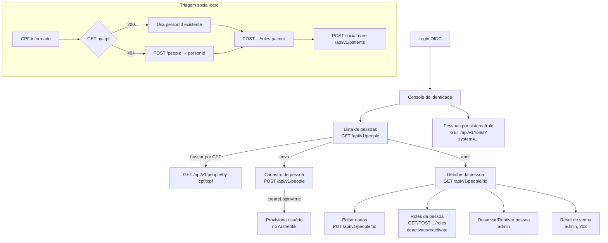

# Fluxo de Integração Frontend ↔ people-context

Guia para o time de frontend (Flutter, via BFF) construir as telas sobre a API do `people-context`. Os cenários Gherkin dos arquivos `01`–`04` são os **critérios de aceite** de cada tela. O people-context é o **registro central de identidade**: o frontend o consome em dois contextos — o **console de identidade** (telas administrativas próprias) e a **triagem do social-care** (busca/cria pessoa antes de registrar paciente).

## 1. Pré-requisitos transversais

- **Auth**: `Authorization: Bearer <jwt>` em tudo, exceto `/health`/`/ready`. O BFF encaminha o Bearer recebido (ADR-023).
- **⚠️ Diferença em relação ao social-care**: toda **mutação** (POST/PUT) exige também o header **`X-Actor-Id`** — sem ele a API devolve `400 AUTH-003`. O BFF deve preenchê-lo com o `sub` do JWT validado; **nunca** aceitar esse valor do app cliente.
- **Envelopes**: sucesso `{ data, meta: { timestamp } }`; listagem com `meta.pageSize/totalCount/hasMore/nextCursor`; erro `{ success: false, error: { code, message } }` (shape de erro ligeiramente diferente do social-care, que não tem `success`).
- **204 sem corpo**: `PUT /people/:id`, deactivate/reactivate e mutações de role devolvem `204 No Content` — não tentar fazer parse de JSON.
- **Idioma**: API toda em inglês; tradução para PT-BR é responsabilidade da UI.

## 2. Mapa geral do fluxo

## 3. Telas e contratos

### 3.1 Lista de pessoas
- `GET /api/v1/people?search=&cursor=&limit=20` — `search` casa nome (ILIKE) e **prefixo de CPF**; um único campo de busca na UI atende os dois.
- Paginação cursor-based idêntica à do social-care (`meta.nextCursor`, `meta.hasMore`); `limit` máx. 100.

### 3.2 Cadastro de pessoa (`POST /api/v1/people`, roles `worker`/`admin`)
Campos do formulário, espelhando o request:

| Campo | Obrigatório | Validação no cliente |
|---|---|---|
| `fullName` | sim | 1–200 caracteres, não só espaços |
| `birthDate` | sim | `YYYY-MM-DD`, não-futura |
| `cpf` | não | 11 dígitos + dígito verificador |
| `email` | não (sim se `createLogin`) | formato de e-mail |
| `createLogin` | não | toggle "criar acesso ao sistema" |
| `initialPassword` | se `createLogin` | mínimo 8 caracteres |

Respostas a tratar:
- **201** — pessoa criada (ou **já existia com aquele CPF**: o dedup é silencioso, `data.id` é a pessoa existente; a UI pode informar "pessoa já cadastrada, abrindo registro existente").
- **207 Multi-Status** — pessoa criada, mas o login no IdP falhou (`warnings[0].code = "IDP-001"`). A UI deve deixar claro: "Pessoa salva; acesso não criado — tente novamente mais tarde" (não é erro total; não reenviar o cadastro).
- **400 PEO-001** — mostrar `error.message` no campo correspondente.

### 3.3 Detalhe e edição
- `GET /api/v1/people/:id` traz tudo, incluindo `active`, `idpUserId` (a pessoa tem login?) e `email`. Exibir badge "com acesso"/"sem acesso" com base em `idpUserId`.
- `PUT /api/v1/people/:id` envia o objeto **completo** (`fullName`, `birthDate`, `cpf?`) — substituição, não merge. Sucesso = 204; refazer o GET.

### 3.4 Gestão de roles (aba na tela da pessoa)
- Listar: `GET .../roles` (toggle "incluir inativas" → sem query `active`).
- Atribuir (`POST .../roles`, admin): selects de `system` (`social-care`, `queue-manager`, `therapies`, `timesheet`) e `role` (`patient`, `professional`, `family-member`, `employee`, `therapist`) — valores conhecidos, mas o serviço aceita novos; manter os selects configuráveis.
- A UI deve antecipar as três regras de autorização (cenários ROL-A002/A004/A005): esconder a opção `superadmin` de quem não é superadmin, e tratar `403 ROL-007` ("você não administra esse sistema") e `403 ROL-008` ("não é possível atribuir role a si mesmo") com mensagens específicas.
- **204 na atribuição = role já existia ativa** — tratar como sucesso idempotente, não como erro.
- Desativar/reativar: `PUT .../roles/:roleId/{deactivate,reactivate}` → 204; `404 ROL-002/ROL-003` significa que o estado mudou em outra sessão → recarregar a lista.

### 3.5 Ciclo de vida e reset de senha (admin)
- Desativar/reativar pessoa: confirmação explícita na UI (desativa também o acesso no Authentik). `409 PEO-005/006` = estado já era esse; `502 IDP-002/003` = IdP fora, **nada mudou**, oferecer retry.
- Reset de senha: `POST .../request-password-reset` → **202** significa "e-mail será enviado" (via queue-manager). A UI **nunca** recebe nem exibe o link de recuperação (ADR-030) — mostrar apenas "instruções enviadas para o e-mail cadastrado". `422 PEO-007` = pessoa sem login → sugerir criar acesso primeiro.

### 3.6 Consulta por sistema (`GET /api/v1/roles?system=...&role=...&active=`)
Tela de listagem transversal ("todos os pacientes do social-care", "profissionais do queue-manager"). Retorna pares `{ person, role }` — já vem com `fullName`/`cpf`/`birthDate`, sem precisar de N chamadas de detalhe.

## 4. Fluxo de triagem integrado com o social-care

Sequência que o frontend executa ao registrar um paciente (complementa `social-care/docs/qa/05-fluxo-frontend.md`, seção 5.2, etapa 1 — é daqui que sai o `personId`):

1. `GET /api/v1/people/by-cpf/{cpf}` —
   - **200**: usar `data.id` como `personId`; exibir os dados para confirmação.
   - **404 PEO-002**: seguir para o passo 2.
2. `POST /api/v1/people` com os dados da pessoa → `personId` (atenção ao 207).
3. `POST /api/v1/people/{personId}/roles` com `{ "system": "social-care", "role": "patient" }` (exige admin — se o operador for só `worker`, o BFF/backoffice precisa intermediar essa etapa).
4. `POST social-care /api/v1/patients` com o `personId`.

Se o passo 4 falhar com `503 REGP-031`, o social-care não enxergou o people-context — a pessoa **já está criada**; ao tentar de novo, repetir a partir do passo 1 (o dedup por CPF garante idempotência).

## 5. Tratamento de erros padronizado

| HTTP | Códigos | Ação da UI |
|---|---|---|
| 400 | `PEO-001/003/004`, `ROL-001/004/005`, `AUTH-003` | Mensagem no campo; `AUTH-003` é bug de BFF (header faltando) — logar |
| 401 | `AUTH-001` | Renovar token e repetir 1x; senão, login |
| 403 | `AUTH-002`, `ROL-006/007/008` | Mensagem específica por código (ver 3.4) |
| 404 | `PEO-002`, `ROL-002/003` | Recarregar dado/lista com aviso |
| 207 | `IDP-001` (warning) | Sucesso parcial: pessoa salva, login não — informar e seguir |
| 409 | `PEO-005/006`, `ROL-009` | Estado mudou em outra sessão → recarregar |
| 422 | `PEO-007` | "Pessoa sem acesso ao sistema" → oferecer criar login |
| 502 | `IDP-002/003/004` | IdP fora; estado não mudou → botão "tentar novamente" |
| 503 | — (`/ready`) | Banco fora; tela de indisponibilidade |

## 6. Ordem recomendada de implementação (incrementos verticais)

1. **Lista + busca + detalhe de pessoa** (leitura pura — valida auth, envelopes, cursor e o shape de erro com `success: false`).
2. **Cadastro sem login** (primeira escrita; exercita `PEO-001`, dedup por CPF e `X-Actor-Id`).
3. **Cadastro com login** (`createLogin` + tratamento do 207).
4. **Aba de roles** (atribuição com as 3 regras de 403, idempotência do 204, deactivate/reactivate).
5. **Ciclo de vida + reset de senha** (409, 502, 202 sem link).
6. **Consulta por sistema** (`GET /api/v1/roles`) e integração da **triagem** com o social-care.

Cada incremento fecha quando os cenários Gherkin correspondentes (arquivos `01`–`04`) passam contra DEV.
